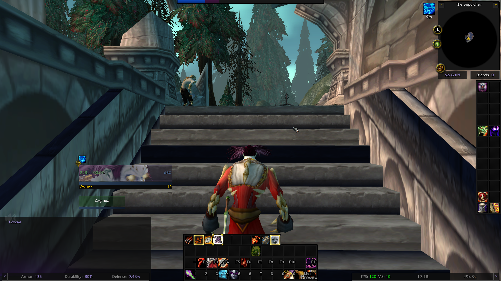
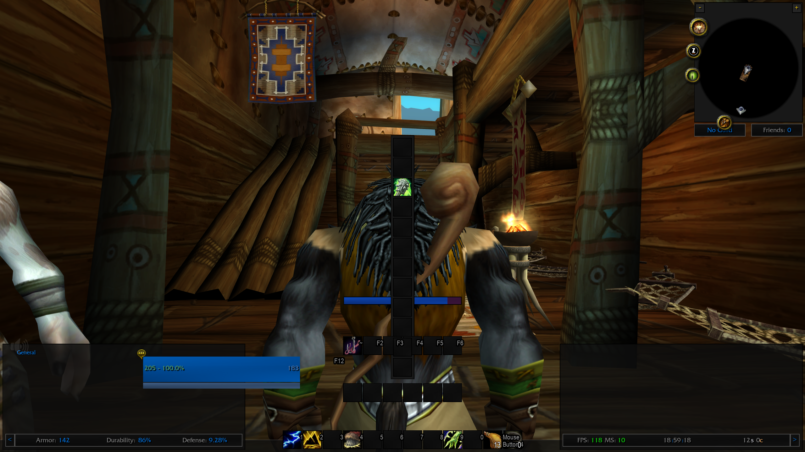
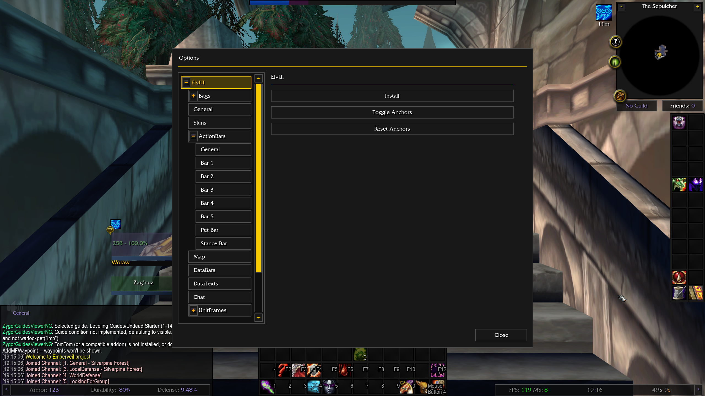
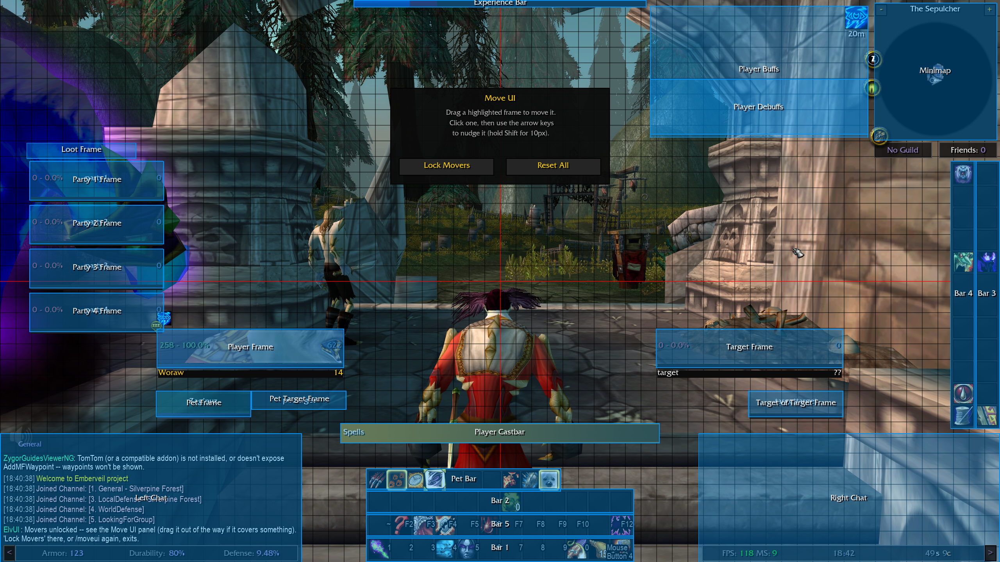

  
# ElvUI

ElvUI rewrite for World of Warcraft — built from scratch to run on **both**
vanilla 1.12.1 and **Unreal Azeroth** (a from-scratch UE5 reimplementation
of the 1.12.1 client). ElvUI is a full UI replacement: it replaces the
default Blizzard UI at every level — unit frames, action bars, chat,
data panels, and every native Blizzard window it reskins in place — with
one coherent, configurable interface instead of a pile of separate addons.

The goal is to stay as visually and API-close to the real ElvUI as this
engine allows, so that an existing "real" ElvUI profile (the plain Lua
table `SavedVariables` format, not the modern compressed one) can
eventually be loaded as-is.

Two addons ship together:
- **ElvUI** — the main addon (unit frames, action bars, chat, data texts,
  movers, aura tracking, Blizzard-window skinning, and more).
- **ElvUI_Config** — the options window, since the stock
  `AceConfigDialog-3.0`/`InterfaceOptionsFrame_OpenToCategory` path is
  broken on Unreal Azeroth. Built on `LibConfig-1.0` instead.

## Install

- Copy both `ElvUI` and `ElvUI_Config` into your `Interface/AddOns`
  directory. Both are required — `ElvUI_Config` is the options window and
  won't work standalone.
- Fully restart the client after adding it for the first time (a
  `/reload` only reloads already-known files, not newly added addons).
- Works on both a vanilla 1.12.1 client and Unreal Azeroth, unmodified.

## Status

**Done:**
- Core engine (profiles, defaults, SavedVariables layout matching real
  ElvUI where practical)
- Layout (screen panels, minimap panels, mover system)
- ActionBars, PetBar/StanceBar, Cooldown text
- UnitFrames (player/target/pet/party/etc.), Auras
- Heal prediction for your own heals: the healing still to come from the
  heal you are casting and from your heal-over-time spells (Rejuvenation,
  Renew, Regrowth) is shown on the target's health bar, extending past its
  end for the overheal (the amount of each spell rank is learned from your
  own heals)
- DataBars (XP/Reputation), DataTexts
- Chat
- Bags/Bank, with gray items sold automatically at a vendor (one at a
  time, with an adjustable interval and an optional progress bar), item
  quality and quest item borders, a "!" on items that start a quest, and an
  optional junk coin on sellable gray items
- Automatic repair at a merchant
- Solo loot and group loot rolls (Need/Greed/Pass bars, optional auto greed)
- Raid marker ring (a key binding opens the eight raid target icons at the
  cursor; legacy client)
- Tooltip: class/reaction-coloured unit tooltips, guild rank,
  level/classification line, target and "targeted by" info, movable anchor
  or cursor anchor, flat ElvUI skin, health bar with health text, sell
  price / item count / item ID lines on item tooltips, the equipped item(s)
  shown beside an item tooltip while Shift is held, visibility rules
  (modifier key / hide in combat) for unit frames, bags and action bars,
  and an options page for all of these
- Install Wizard
- Lua error window: collects script errors (repeats merged with a count),
  pages through them, the text can be selected and copied, stays closed in
  combat and opens afterwards; `/elvui errors` reopens it, and
  `/elvui errors on` / `off` switches whether it opens by itself
- Skinning of a large and growing set of native Blizzard windows in
  place (Character, Friends, SpellBook, Macro, Key Bindings, Main Menu,
  Interface/Video/Sound Options, Gossip/Greeting/Quest/QuestLog,
  Merchant, Trade, Taxi, Pet Stable, Talents, Trade Skills, Enchanting,
  and more)

**Missing / not yet started:**
- Tooltip item level, inspect info, spell IDs and the tooltip text font
  settings; the health bar font is applied on the legacy client only
  (Unreal Azeroth ignores font changes), and on Unreal Azeroth the item
  lines are not yet
  shown on action buttons (the client offers no way to read the item of an
  action slot)
- A handful of native windows not yet reskinned (Auction House, Mail,
  Trainer, Tabard, World Map polish, and a few more niche ones)
- Nameplate customization — blocked by a client-side limitation on
  Unreal Azeroth, parked until that changes
- Heal prediction covers only your own direct heals and your Rejuvenation,
  Renew and Regrowth: other players' incoming heals, channelled heals
  (Tranquility, Mend Pet, bandages) and heals on several targets (Prayer of
  Healing, Chain Heal) are not predicted yet. A spell rank predicts nothing
  until one of its heals has landed once (a heal-over-time's tick amount only
  on a damaged target), a heal-over-time removed early still shows until its
  normal duration ends, and set bonuses that lengthen one are not taken into
  account
- A few smaller ElvUI features (auto-track reputation, chat-anchored
  data panels) are researched but not built yet

## Known issues

- Raid marker (Unreal Azeroth): the "Raid Marker" key binding does not show
  up in the Key Bindings window, because the client does not register key
  bindings declared by addons yet. It works on the legacy client.
- Tooltip (Unreal Azeroth): with an ActionBars visibility modifier set, on
  pet command buttons (Attack, Follow, Stay, Aggressive, Defensive,
  Passive) pressing the modifier while already hovering does not bring the
  tooltip up; hovering the button with the modifier held works.
- A number of settings still require a full UI reload to take effect; the
  options window tells you when that's the case, and a confirmation
  popup offers to reload for you.

## Sources

Re-used ideas/recipes from the following projects:
- [ElvUI](https://www.tukui.org/elvui.php) — the addon this project
  rewrites from scratch; the closest match to it, plus the
  [ElvUI-Vanilla](https://github.com/ElvUI-Vanilla/ElvUI) backport, is
  the primary structural/API reference throughout.
- [UnrealUI](https://github.com/Tom75VN/UnrealUI) — a UI replacement built
  specifically for Unreal Azeroth; the best reference for what actually
  works on that engine (widget quirks, API gaps, workarounds).
- [pfUI](https://github.com/shagu/pfUI) — proven vanilla-compatible skin
  recipes for native Blizzard windows.
- [Bagzen](https://github.com/dh-harald/Bagzen) — bag/bank item-slot
  skinning recipe.

## Development

Built with heavy use of [Claude Code](https://claude.com/claude-code)
(Anthropic) — architecture, modules, Blizzard-window skinning, dual-client
compatibility work, and documentation.

## Screenshots

## Tested on

- WoW 1.12.1 (Legacy client)
- WoW 1.12.1 (Unreal Azeroth)
