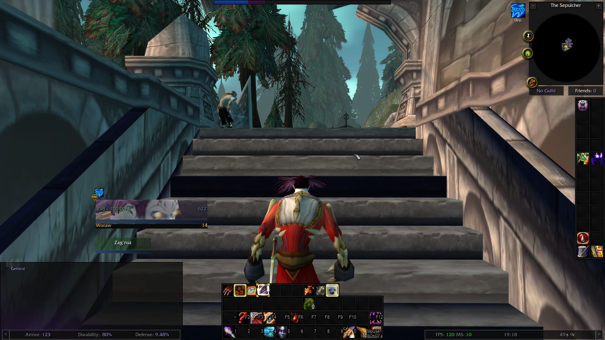
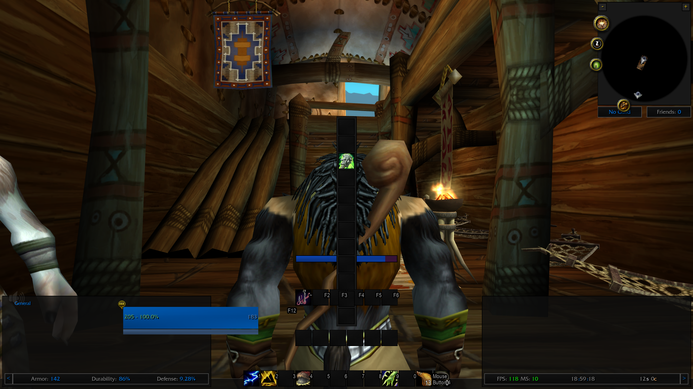
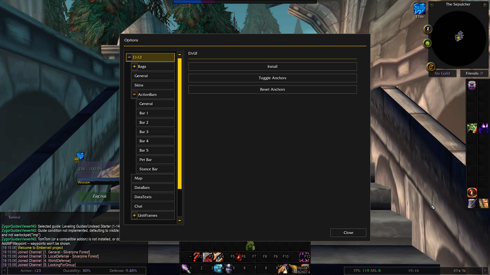
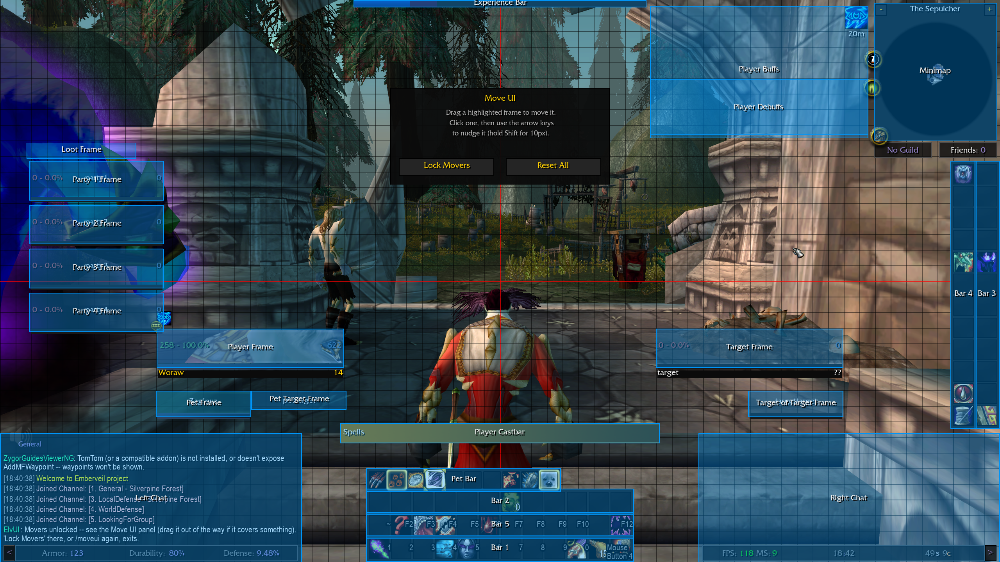

  
# ElvUI

ElvUI rewrite for World of Warcraft — built from scratch to run on **both**
vanilla 1.12.1 and **Unreal Azeroth** (a from-scratch UE5 reimplementation
of the 1.12.1 client). ElvUI is a full UI replacement: it replaces the
default Blizzard UI at every level — unit frames, action bars, chat,
data panels, and every native Blizzard window it reskins in place — with
one coherent, configurable interface instead of a pile of separate addons.

The goal is to stay as visually and API-close to the real ElvUI as this
engine allows, so that an existing "real" ElvUI profile (the plain Lua
table `SavedVariables` format, not the modern compressed one) can
eventually be loaded as-is.

Two addons ship together:
- **ElvUI** — the main addon (unit frames, action bars, chat, data texts,
  movers, aura tracking, Blizzard-window skinning, and more).
- **ElvUI_Config** — the options window, since the stock
  `AceConfigDialog-3.0`/`InterfaceOptionsFrame_OpenToCategory` path is
  broken on Unreal Azeroth. Built on `LibConfig-1.0` instead.

## Install

- Copy both `ElvUI` and `ElvUI_Config` into your `Interface/AddOns`
  directory. Both are required — `ElvUI_Config` is the options window and
  won't work standalone.
- Fully restart the client after adding it for the first time (a
  `/reload` only reloads already-known files, not newly added addons).
- Works on both a vanilla 1.12.1 client and Unreal Azeroth, unmodified.

## Status

**Done:**
- Core engine (profiles, defaults, SavedVariables layout matching real
  ElvUI where practical)
- Profile export/import in the format of current ElvUI (`!E2!` strings) or
  as a plain Lua table, for the profile and the character (private)
  settings; exports only hold what differs from the defaults, and an import
  drops settings this addon does not know. Import also reads ElvUI-vanilla's
  own exports (its compressed text and its Lua table)
- Layout (screen panels, minimap panels, mover system)
- ActionBars, PetBar/StanceBar, Cooldown text
- Target aura time on action buttons (later ElvUI's "Target Aura"): a
  spell's button (or a macro button with `/cast`) shows how long your own
  debuff lasts on the target while the spell itself has no cooldown. Own
  casts are timed when they happen,
  so the target frame's debuff timers are exact for your own spells too
- UnitFrames (player/target/pet/party/etc.), Auras; debuff timers on other
  units through LibVanillaDurations-1.0 (pfUI's spell duration data)
- Temporary weapon enchants (shaman weapon imbues, rogue poisons,
  sharpening stones, oils) at the front of the buff row, with time left and
  charges — the client does not list them as buffs
- Aura bars on the player and target frames (ElvUI's `aurabar`, from retail
  ElvUI): your own timed auras as draining bars; the install wizard offers
  "Aura Bars & Icons" or "Icons Only"
- Threat display on the unit frames (all of ElvUI's `threatStyle` modes):
  the client has no threat data, so it shows who has aggro, through
  LibBanzai-1.0
- Estimated health of hostile mobs and players (LibMobHealth-4.0): the
  client only reports them in percent, so their real health is learned from
  the damage dealt to your target and saved account-wide; shown on the unit
  frames and the tooltip
- Heal prediction through LibHealComm-1.0: the healing still to come on a
  player — heals being cast (yours and, over the HealComm addon channel,
  other players') and the rest of Rejuvenation, Renew and Regrowth — is shown
  on the health bar in two colours (yours, others'), extending past its end
  for the overheal
- Combo point bar on the target frame (rogue, and druid in Cat Form):
  filled or spaced, auto-hides at 0 points, colours per point
- Resurrection icon on the party, target and your own player frame while
  someone running HealComm is resurrecting that player
- Target castbar: the 1.12 client reports no casts of other units, so the
  bar is rebuilt from the combat log ("… begins to cast …") with cast times
  and icons from pfUI's spell database; kicks, stuns and other interrupts
  end it with "Interrupted". Mobs that share a name cannot be told apart,
  and channelled spells of others are not shown
- DataBars (XP/Reputation), DataTexts
- Chat
- Bags/Bank, with gray items sold automatically at a vendor (one at a
  time, with an adjustable interval and an optional progress bar), item
  quality and quest item borders, a "!" on items that start a quest, an
  optional junk coin on sellable gray items, and a sort button (stacks
  merged, quest items first, quivers/ammo pouches/soul bags filled with
  their own items)
- Automatic repair at a merchant
- Interrupt announce: your interrupts (Kick, Pummel, Counterspell, ...)
  posted to say, emote, party or raid chat while in a group
- Colour picker: an ElvUI-styled replacement for the native one, used by
  the chat window menu's colour swatches (channel and message colours,
  window background and opacity); works on Unreal Azeroth, where the
  native picker cannot select a colour
- Solo loot and group loot rolls (Need/Greed/Pass bars, optional auto greed)
- Raid marker ring (a key binding opens the eight raid target icons at the
  cursor; legacy client)
- Totem tracker (shaman): one button per element with the active totem and
  its time left, cleared when the totem is destroyed; optional pulse timer
  (Tremor, Earthbind, Magma, ...) and Windfury twist timer. The client has
  no totem API, so the state comes from your own casts and combat log
- Leave Druid form: when a spell, item, mount, taxi or NPC talk fails
  because you are shapeshifted, leaves the form at once or shows a big
  button for it (General → General → Leave Shapeshift Form: None / Manual /
  Automatic); right-clicking a mob you can attack never leaves the form
- Auto track reputation: the reputation bar switches to the faction you
  just gained reputation with (General → General → Auto Track Reputation)
- AFK screen: while you are away the UI is hidden and a panel shows your
  character, guild and the time away, with whispers and guild chat listed
  in the corner; a key press or click brings the UI back and clears AFK (General →
  General → AFK Mode)
- Tooltip: class/reaction-coloured unit tooltips, guild rank,
  level/classification line, target and "targeted by" info, movable anchor
  or cursor anchor, flat ElvUI skin, health bar with health text, sell
  price / item count / item ID lines on item tooltips, the equipped item(s)
  shown beside an item tooltip while Shift is held, with the stat change
  of swapping each one (bonuses via LibItemBonusLib-1.0, plus armor and
  weapon DPS), visibility rules
  (modifier key / hide in combat) for unit frames, bags and action bars,
  and an options page for all of these
- Fonts: the General → Media default font and size, combat text and name
  fonts, and "Apply Font To All" — applied to the native Blizzard text,
  ElvUI's own text and the tooltip text (legacy client; Unreal Azeroth
  ignores font changes)
- Install Wizard
- Lua error window: collects script errors (repeats merged with a count),
  pages through them, the text can be selected and copied, stays closed in
  combat and opens afterwards; `/elvui errors` reopens it, and
  `/elvui errors on` / `off` switches whether it opens by itself
- Skinning of a large and growing set of native Blizzard windows in
  place (Character, Friends, SpellBook, Macro, Key Bindings, Main Menu,
  Interface/Video/Sound Options, Gossip/Greeting/Quest/QuestLog,
  Merchant, Trade, Taxi, Pet Stable, Talents, Trade Skills, Enchanting,
  Trainer, Mail, Auction House, Dressing Room, World Map, Stack Split, and
  more).
  Where ElvUI has its own module for a window (Bags/Bank, Mailbox, Mirror
  Timers), the module decides its look while it is on; with the module off,
  the window's skin toggle takes over, so e.g. the native bags and bank can
  still be restyled with quality-coloured slot borders
- Mailbox: open several mails at once (all of them, or the ones ticked with
  a checkbox), send the ticked ones back to their senders, stop a run in
  progress, Shift-click or Ctrl-click a row to take or return that one mail,
  a warning colour on mail that will be deleted rather than returned when it
  expires, and tidying away the mail a run emptied
- Sending mail: queue up to twelve items at once and send them in one go,
  with recipient-name completion from your own characters, friends, guild and
  the people you have written to before

**Missing / not yet started:**
- Tooltip item level, inspect info and spell IDs; the tooltip text and
  health bar fonts are applied on the legacy client only
  (Unreal Azeroth ignores font changes), and on Unreal Azeroth the item
  lines are not yet
  shown on action buttons (the client offers no way to read the item of an
  action slot)
- A handful of native windows not yet reskinned (Tabard and a few more
  niche ones)
- Nameplate customization — blocked by a client-side limitation on
  Unreal Azeroth, parked until that changes
- Heal prediction: channelled heals (Tranquility, Mend Pet, bandages) are not
  predicted, Chain Heal only on its first target, and another player's
  heal-over-time only by estimate until its first tick (the HealComm protocol
  carries no amount for it). Pets and NPCs get no prediction.
- A few smaller ElvUI features (chat-anchored data panels) are researched
  but not built yet

## Known issues

- Raid marker (Unreal Azeroth): the "Raid Marker" key binding does not show
  up in the Key Bindings window, because the client does not register key
  bindings declared by addons yet. It works on the legacy client.
- Interrupts (Unreal Azeroth): the target castbar does not switch to
  "Interrupted" when its cast is kicked, and Announce Interrupts sends
  nothing, because the client does not write interrupts to the combat log.
  The bar still ends when the cast's time is up or the target dies.
- Tooltip (Unreal Azeroth): with an ActionBars visibility modifier set, on
  pet command buttons (Attack, Follow, Stay, Aggressive, Defensive,
  Passive) pressing the modifier while already hovering does not bring the
  tooltip up; hovering the button with the modifier held works.
- A number of settings still require a full UI reload to take effect; the
  options window tells you when that's the case, and a confirmation
  popup offers to reload for you.

## Sources

Re-used ideas/recipes from the following projects:
- [ElvUI](https://www.tukui.org/elvui.php) — the addon this project
  rewrites from scratch; the closest match to it, plus the
  [ElvUI-Vanilla](https://github.com/ElvUI-Vanilla/ElvUI) backport, is
  the primary structural/API reference throughout.
- [UnrealUI](https://github.com/Tom75VN/UnrealUI) — a UI replacement built
  specifically for Unreal Azeroth; the best reference for what actually
  works on that engine (widget quirks, API gaps, workarounds).
- [pfUI](https://github.com/shagu/pfUI) — proven vanilla-compatible skin
  recipes for native Blizzard windows.
- [Bagzen](https://github.com/dh-harald/Bagzen) — bag/bank item-slot
  skinning recipe.

## Development

Built with heavy use of [Claude Code](https://claude.com/claude-code)
(Anthropic) — architecture, modules, Blizzard-window skinning, dual-client
compatibility work, and documentation.

## Screenshots

## Tested on

- WoW 1.12.1 (Legacy client)
- WoW 1.12.1 (Unreal Azeroth)
